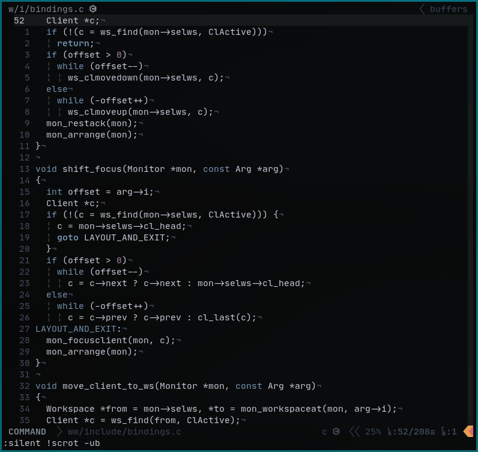
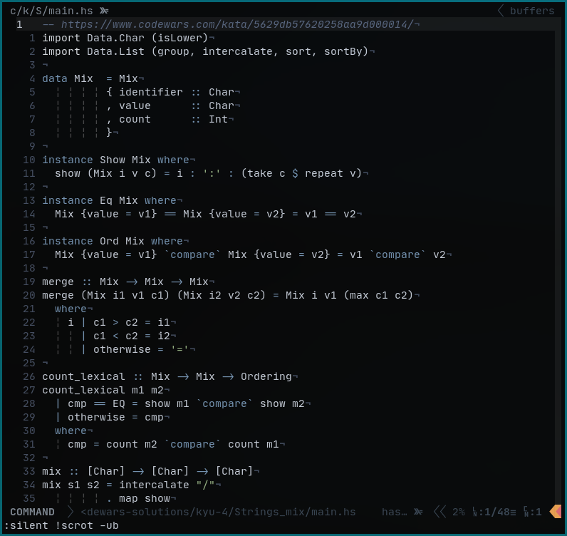

grid.vim
--------
This is a very opinionated color scheme designed to the get the feeling of being in the [***grid***](https://tron.fandom.com/wiki/Grid).
*(This is built on top of the vim port of the [Nord Theme](https://www.nordtheme.com/ports/vim))*

#### C

#### Golang

#### Rust

#### Python

#### Haskell

